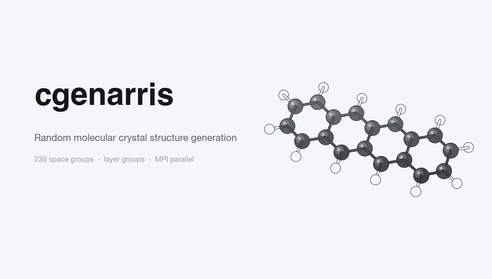

<h1 align="center">cgenarris</h1>

<p align="center">
<strong>Fast, MPI-parallel random structure generation for molecular crystals and 2D layers.</strong><br>
</p>

<p align="center">
<a href="https://github.com/Yi5817/cgenarris/actions/workflows/test.yml"></a>
<a href="LICENSE"></a>


</p>

<p align="center">
<picture>
<source media="(prefers-color-scheme: dark)" srcset="assets/workflow-dark.gif">

</picture>
</p>

---

Give **cgenarris** a molecule and a target volume, and it returns thousands of symmetry-distinct, physically sensible crystal packings. It is the structure-generation engine behind [Genarris](https://doi.org/10.1021/acs.jctc.5c01080), rewritten in C for speed and parallel scaling, so the raw candidate pool for a crystal structure prediction (CSP) workflow can be built in minutes rather than hours.

## Why cgenarris?

- **All 230 space groups, including special positions.** Molecules are placed on general *and* special Wyckoff positions whose site symmetry matches the molecule, so high-symmetry packings are not missed.
- **Layer groups for 2D materials.** Generate molecular monolayers on a substrate by constraining the in-plane lattice to the substrate cell.
- **Physically meaningful filtering built in.** Every candidate is checked against a per-atom-pair van der Waals distance matrix, so you never post-process piles of overlapping structures.
- **Embarrassingly parallel.** Space groups are distributed across MPI ranks; throughput scales with the core count of your cluster.

## Citation

If cgenarris contributes to your research, please cite:

**Molecular crystals**

> Y. Yang, R. Tom, J. A. Wui, J. E. Moussa and N. Marom,
> Genarris 3.0: Generating Close-Packed Molecular Crystal Structures with Rigid Press,
> *J. Chem. Theory Comput*. **21**, 11318–11332 (2025).

> R. Tom, T. Rose, I. Bier, H. O'Brien, Á. Vázquez-Mayagoitia and N. Marom,
> *Genarris 2.0: A random structure generator for molecular crystals*,
> *Comput. Phys. Commun*. **250**, 107170 (2020).

**Layer groups and organic/inorganic interfaces**

> H. Ni, K. Larkin, W. Wen, S. Moayedpour, R. Tom, I. Bier, D. Dardzinski and N. Marom,
> Structure Prediction of Organic/Inorganic Interfaces with Genarris,
> *J. Chem. Theory Comput*. **22**, 4835–4853 (2026).

<details>
<summary>BibTeX</summary>

```bibtex
@article{genarris3,
  title   = {Genarris 3.0: Generating Close-Packed Molecular Crystal Structures with Rigid Press},
  author  = {Yang, Yi and Tom, Rithwik and Wui, Jose A. and Moussa, Jonathan E. and Marom, Noa},
  journal = {J. Chem. Theory Comput.},
  volume  = {21},
  number  = {21},
  pages   = {11318--11332},
  year    = {2025}
}

@article{genarris_interfaces,
  title   = {Structure Prediction of Organic/Inorganic Interfaces with Genarris},
  author  = {Ni, Haoran and Larkin, Kevin and Wen, Wen and Moayedpour, Saeed
             and Tom, Rithwik and Bier, Imanuel and Dardzinski, Derek and Marom, Noa},
  journal = {J. Chem. Theory Comput.},
  volume  = {22},
  number  = {9},
  pages   = {4835--4853},
  year    = {2026}
}

@article{genarris2,
  title   = {Genarris 2.0: A random structure generator for molecular crystals},
  author  = {Tom, Rithwik and Rose, Timothy and Bier, Imanuel and O'Brien, Harriet
             and V{\'a}zquez-Mayagoitia, {\'A}lvaro and Marom, Noa},
  journal = {Comput. Phys. Commun.},
  volume  = {250},
  pages   = {107170},
  year    = {2020}
}
```

</details>

## Contributors

| Name | Contribution | GitHub |
|------|-------------|--------|
| Rithwik Tom | Original author | [@ritwit](https://github.com/ritwit) |
| Yi Yang | Developer | [@Yi5817](https://github.com/Yi5817) |
| Haoran Ni | Layer group generator | [@haoran-ni](https://github.com/haoran-ni) |

Bug reports and pull requests are welcome. Open an [issue](https://github.com/Yi5817/cgenarris/issues) to get started.

## License

cgenarris is available under the [BSD-3-Clause License](LICENSE).
